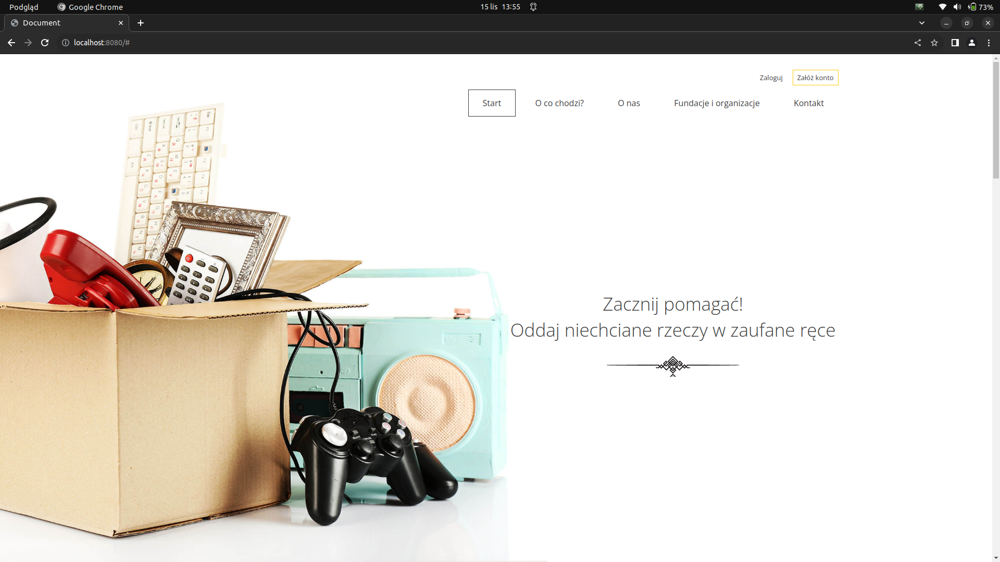
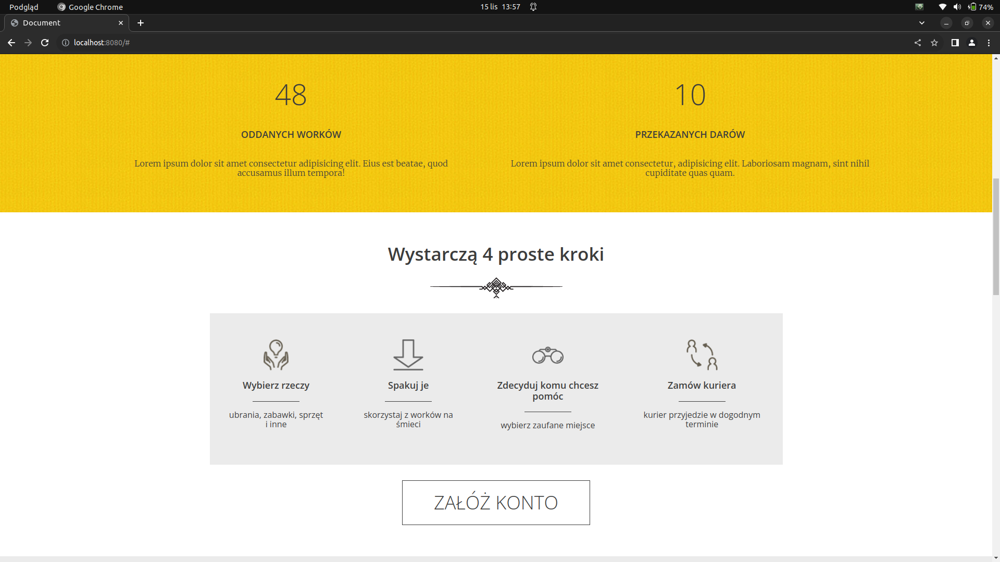
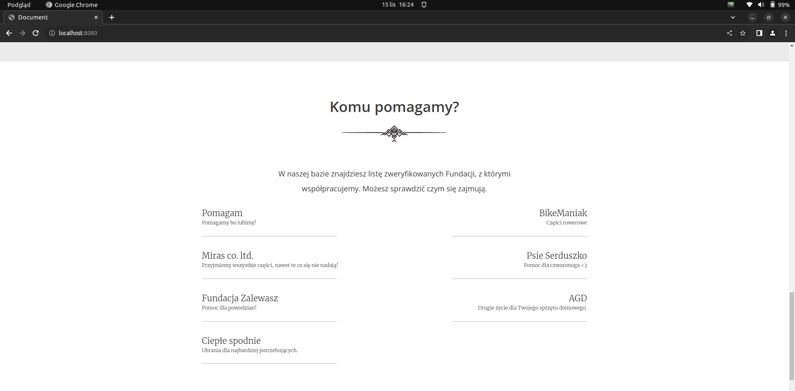
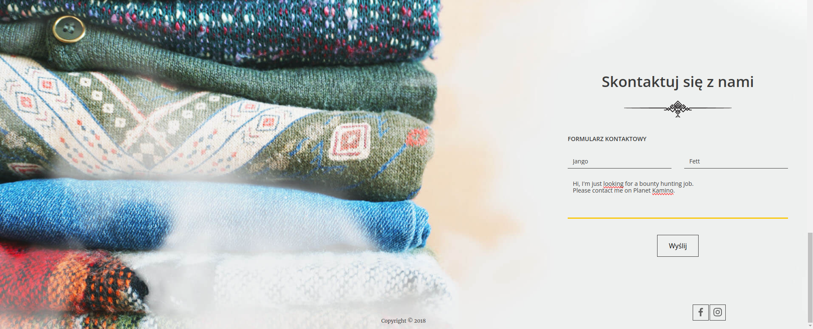
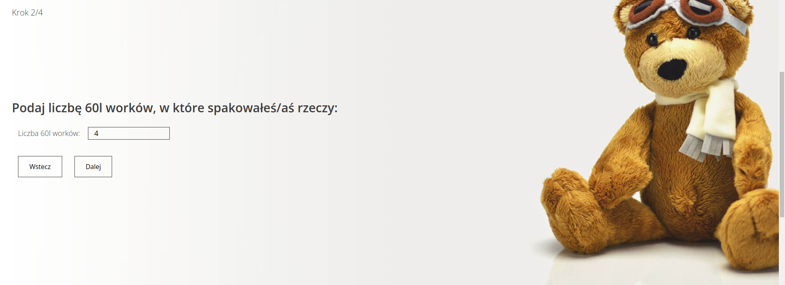
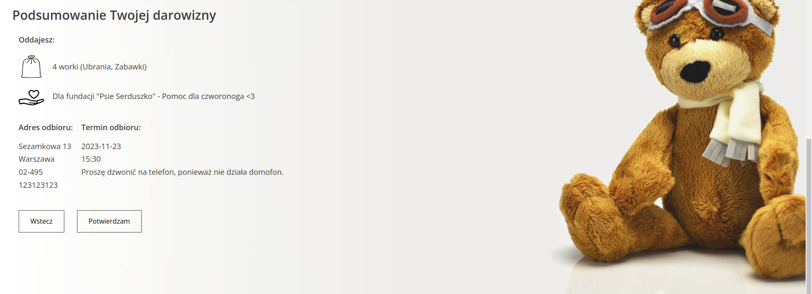
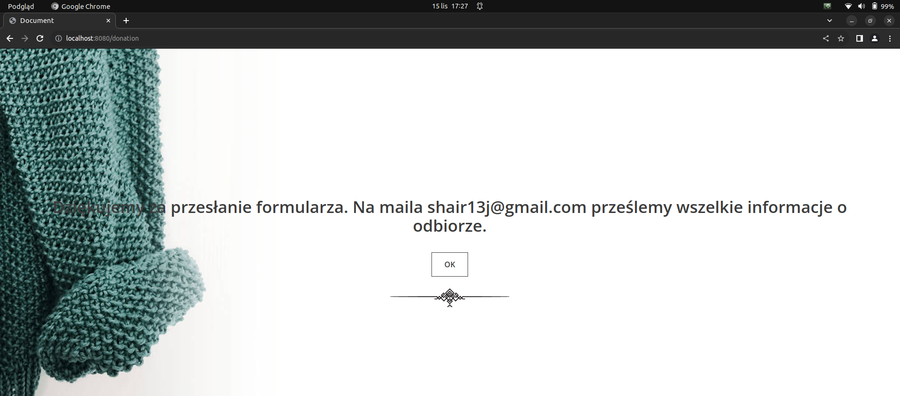

# Charity App - Good deeds without leaving home!

# Description
This is an application for managing charity donations. It allows you to easily pass on unwanted items to people in need. As an admin, you can also manage institutions, donations, users, and other admins.

## Home page

This is the initial page that anyone can access.
By scrolling down you can check how many bags and donations has been given to foundations, how the process works and you can decide to register.

you can also check foundations which whom we are working with.

At the end of the home page, you can find a form to contact us. Feel free to ask any questions if you are not sure about creating an account.

When we receive an email, we will reply as fast as it is possible!

### Donations

Now when you are logged in you can easily go through the donation 4 steps form.

first step (choosing categories of your items):

second step (number of bags you want to give):

third step (choosing foundarion you want to support):

fourth step (parcel collection details):

finally you need to confirm the entered data:

after confirmation you will be redirected to success page:

and also you will receive an email confirming that everything went correctly.

