# Charity App - Good deeds without leaving home!

# Description
This is an application for managing charity donations. It allows you to easily pass on unwanted items to people in need. As an admin, you can also manage institutions, donations, users, and other admins.

### To build

<pre>mvn package</pre>

### To run

<pre>java -jar ./charity-0.0.1-SNAPSHOT.jar</pre>

### The aplication will run on http://localhost:8080 

# Home page

This is the initial page that anyone can access.
By scrolling down you can check how many bags and donations have been given to foundations, how the process works and you can decide to register.

You can also check foundations we are working with.

At the end of the home page, you can find a form to contact us. Feel free to ask any questions if you are not sure about creating an account.

After we receive an email, we will reply as fast as possible!

# Registration

Now that you've decided to register and help someone, you can easily do it by using the registration form:

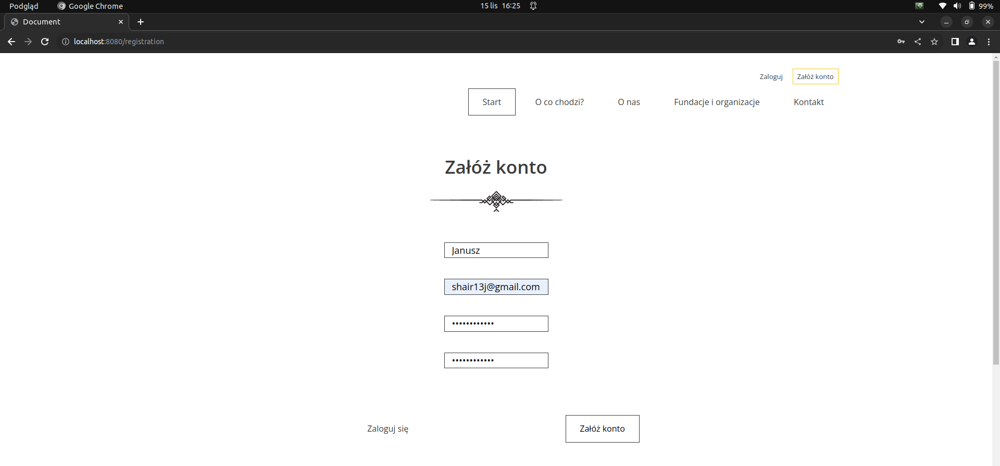

If you input an invalid password (it must contain at least one lowercase letter, one uppercase letter, one digit, and one special character, with a length between 8 and 32 characters), 
you will receive information guiding you on what you did wrong.

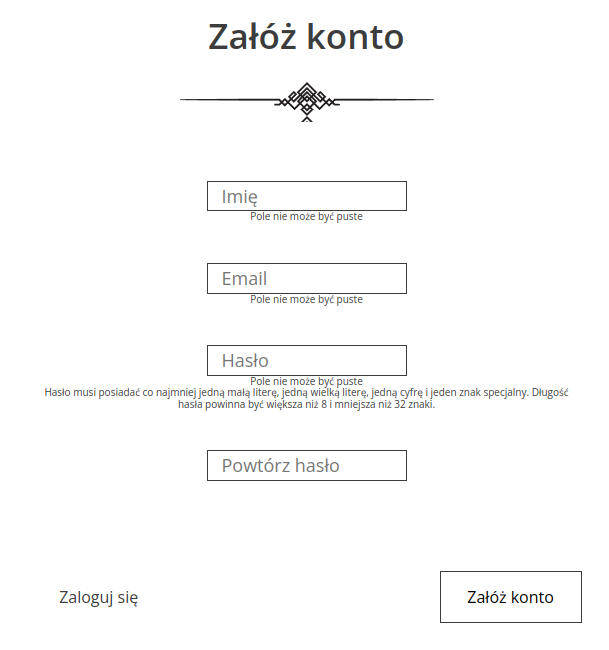

After your registration, you will receive a success confirmation:

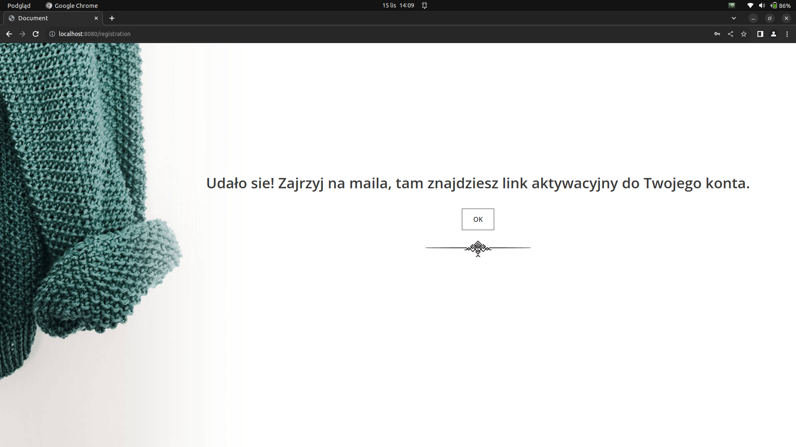

Next, you need to activate your account via email, otherwise, you won't be able to log in:

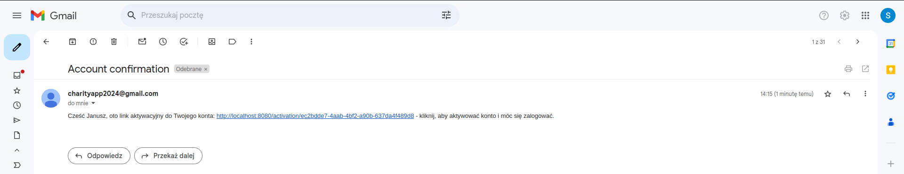

After successful activation, you will see a confirmation page:

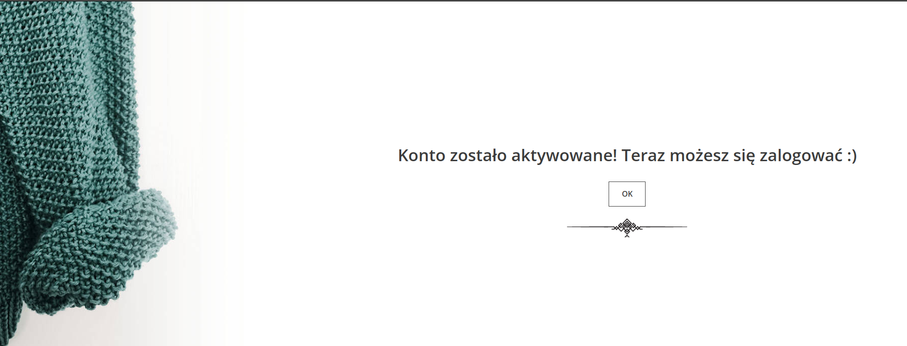

Now, you can log in to your account and help somebody in need.

# Login

Once you have successfully registered on our page, you can log in to your account.

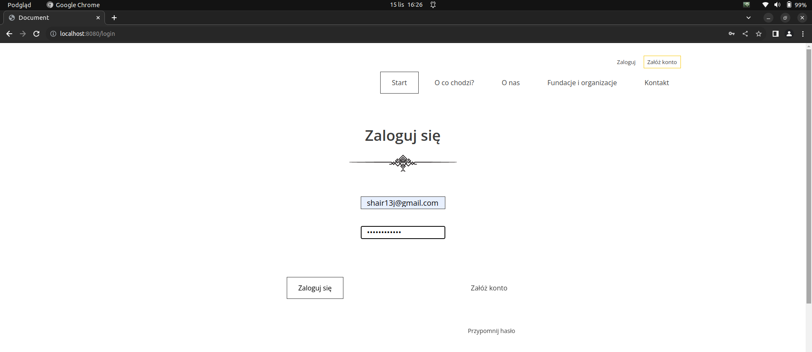

If both the email and password are correct, you will be redirected to the home page, and you will gain access to your account in the top right corner.

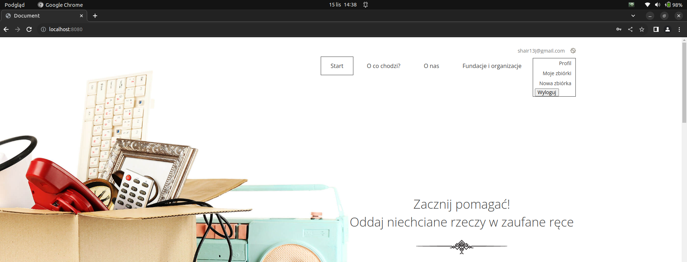

But what do you do if you forget your password?

# Lost Password

What if you forgot your password? No worries, we've got you covered!
Simply go to the password reminder section on the login page. You'll be redirected to the password reminder form, where you only need to provide your email.

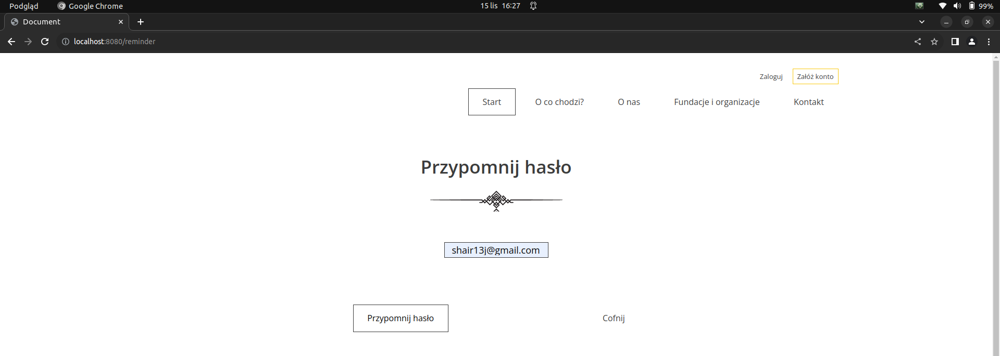

Upon entering the correct email, you'll receive information that we've sent you a link to reset your password.

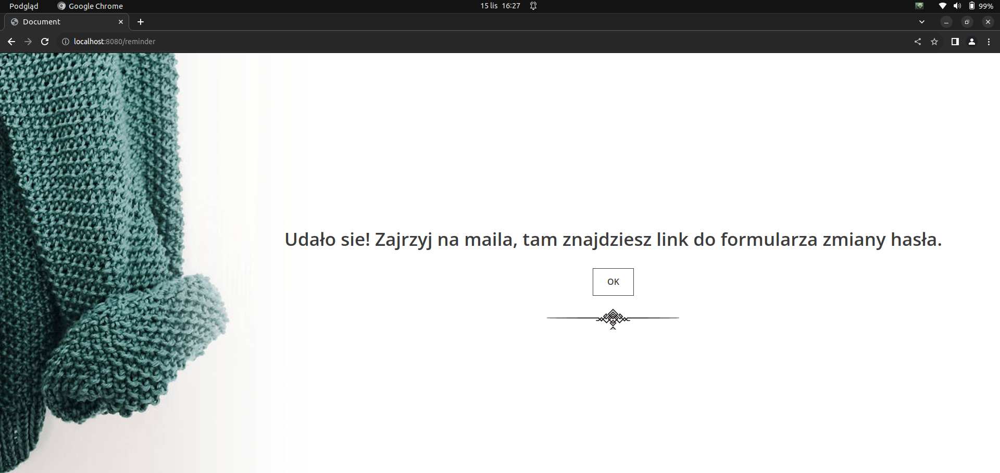

Next, click on the provided link.

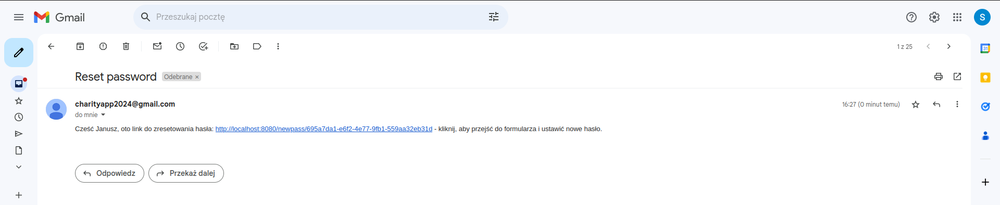

After that, you'll be redirected to the update password form.

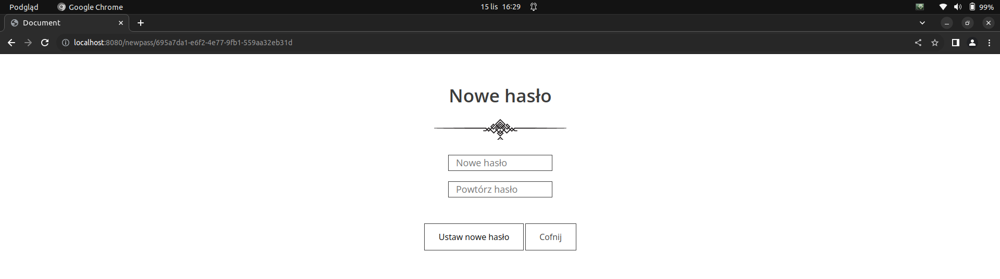

If everything goes correctly, you will receive a confirmation.

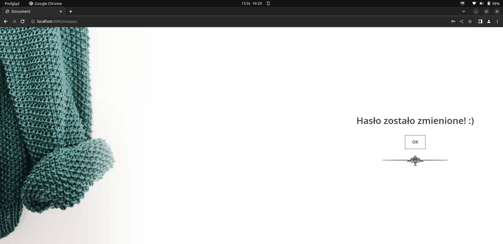

# Donations

__Now when you are logged in you can easily go through the donation 4 steps form.__

1. Categories of your items:

2. Number of bags you want to give:

3. Foundation you want to support:

4. Parcel collection details:

Finally you need to confirm the entered data:

After confirmation you will be redirected to success page:

and also you will receive an email confirming that everything went right.

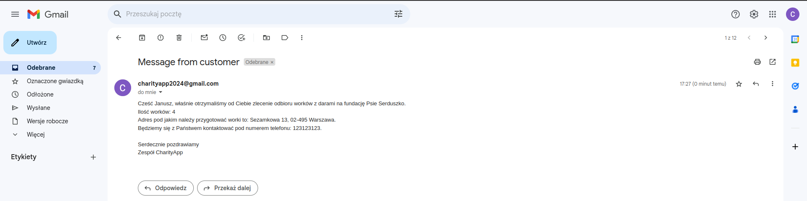

# User Profile

As a user, you can change your name, email, and password.

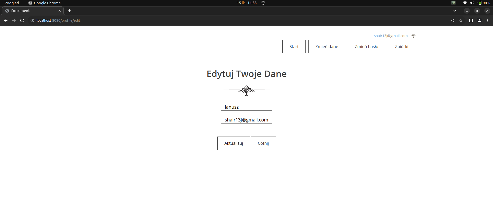

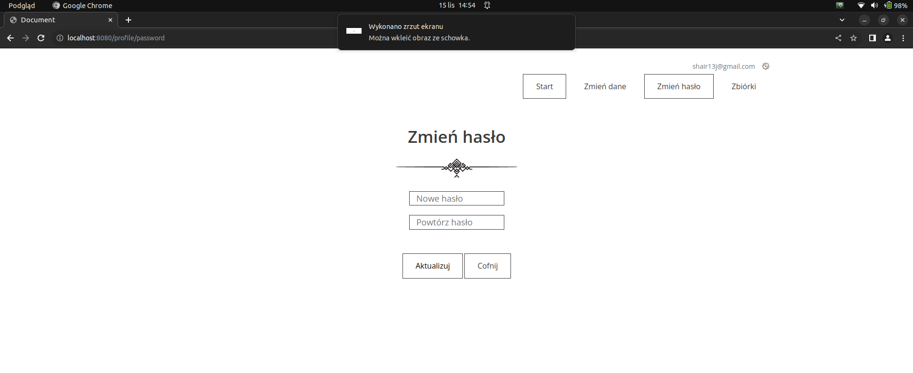

You also have access to your donations. 
We would be very grateful if you marked the parcel as "picked up" in our application after the courier has collected it.
This will make the whole process more efficient :)

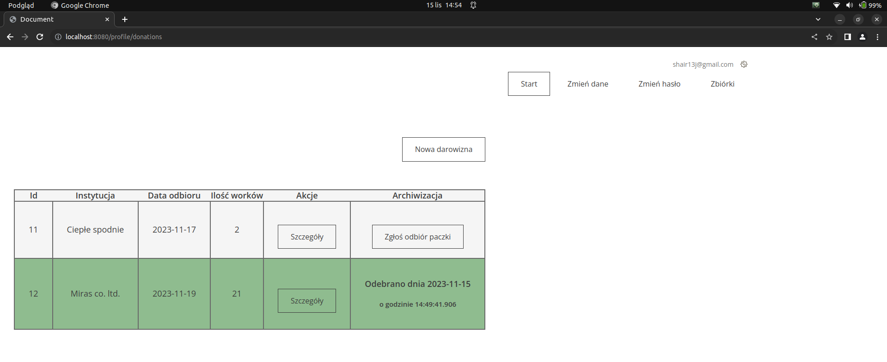

You can review the details of your donations, even after they have been marked as "picked up".

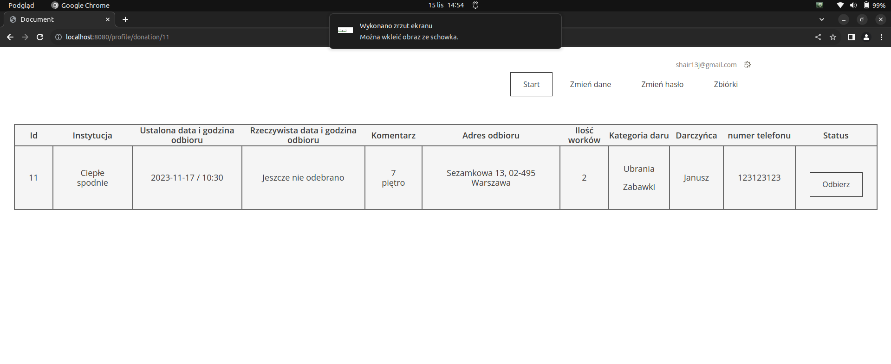

# Admin Panel

As an Admin, you can manage institutions, users, and other admins.

## Institutions
You have the ability to edit or remove an institution.

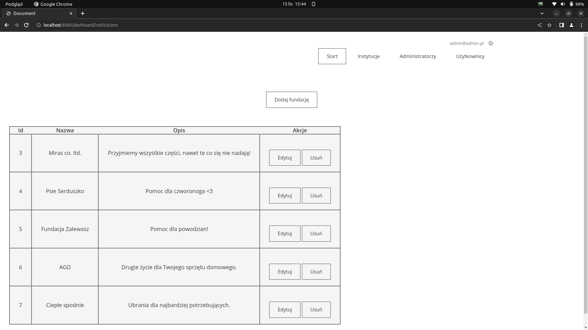

## Users
You can block/unblock and delete/revive (soft delete) users. Blocked users will not be able to log in to their accounts. Admins can also modify all user data such as name, email, password, or account permissions.

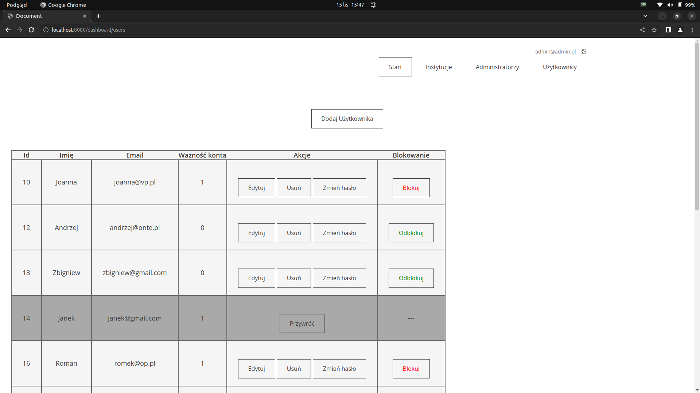

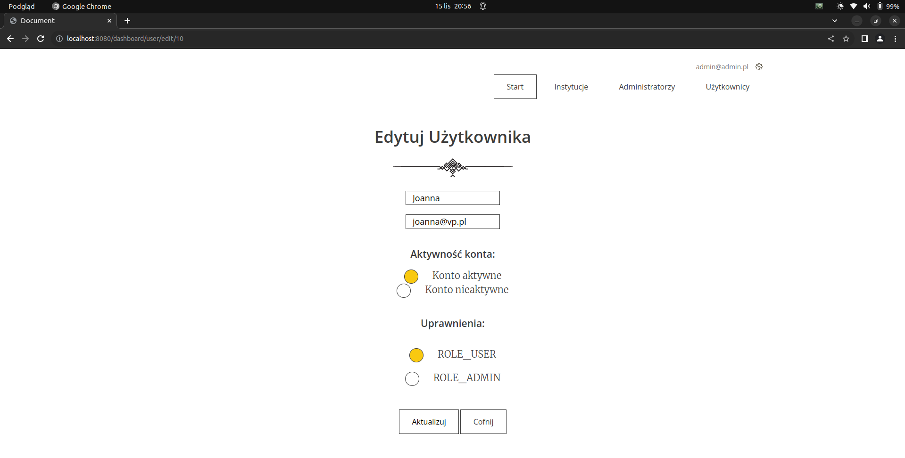

## Admins
First and foremost, you cannot delete yourself - it's for your safety. However, you can delete and revive other admins.

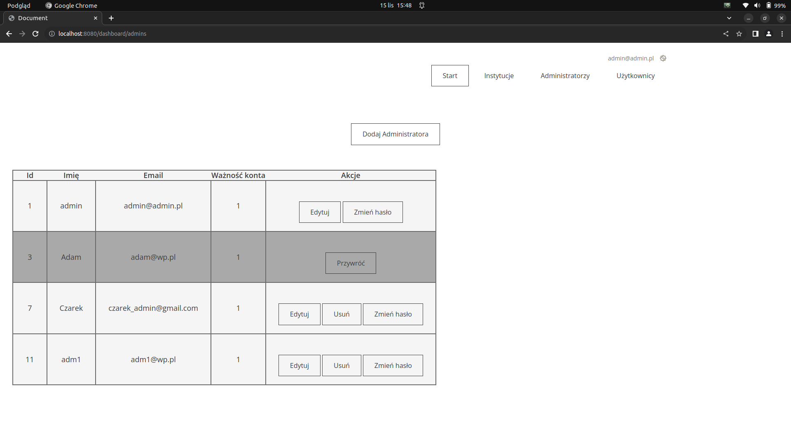

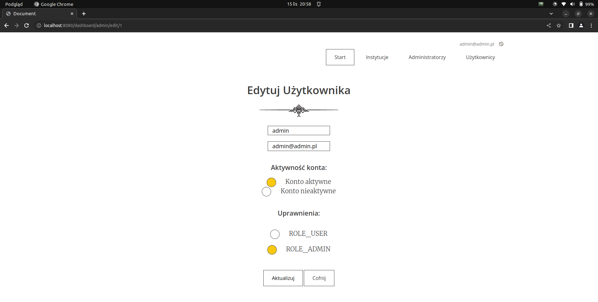

# Conclusion

Thank you for exploring Charity App! We hope this platform makes a positive impact in the world by facilitating easy and effective charitable donations. Your contributions matter, and together, we can make a difference! :)

# Contact

If you have any questions, feedback or issues, feel free to reach out to me:

- Email: cezary.wozakowski@gmail.com

